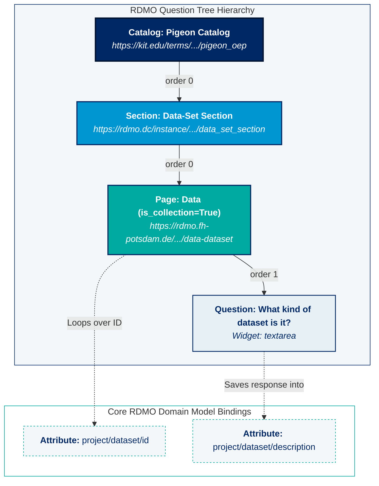

```mermaid
graph TD
    %% HMC Corporate Colour Palette Definitions
    classDef catalog fill:#002864,stroke:#001432,stroke-width:2.5px,color:#fff;
    classDef section fill:#0096d2,stroke:#002864,stroke-width:2px,color:#fff;
    classDef page fill:#00aaa0,stroke:#002864,stroke-width:2px,color:#fff;
    classDef question fill:#e6f0f5,stroke:#002864,stroke-width:1.5px,color:#002864;
    classDef attribute fill:#f4f7f9,stroke:#00aaa0,stroke-width:1px,stroke-dasharray: 3 3,color:#002864;

    %% Hierarchical Question Tree Structure
    subgraph Structure [RDMO Question Tree Hierarchy]
        direction TB
        
        Cat["<b>Catalog: Pigeon Catalog</b><br/><i>https://kit.edu/terms/.../pigeon_oep</i>"]:::catalog
        
        Sec["<b>Section: Data-Set Section</b><br/><i>https://rdmo.dc/instance/.../data_set_section</i>"]:::section
        
        Pg["<b>Page: Data (is_collection=True)</b><br/><i>https://rdmo.fh-potsdam.de/.../data-dataset</i>"]:::page
        
        Q["<b>Question: What kind of dataset is it?</b><br/><i>Widget: textarea</i>"]:::question

        %% Structural Links
        Cat -->|order 0| Sec
        Sec -->|order 0| Pg
        Pg -->|order 1| Q
    end

    %% Data Model Binding Zone
    subgraph Domain [Core RDMO Domain Model Bindings]
        direction TB
        AttrId["<b>Attribute:</b> project/dataset/id"]:::attribute
        AttrDesc["<b>Attribute:</b> project/dataset/description"]:::attribute
    end

    %% Element-to-Attribute mappings
    Pg -.->|Loops over ID| AttrId
    Q -.->|Saves response into| AttrDesc

    %% Structural Alignment Overrides
    style Structure fill:#f4f7f9,stroke:#002864,stroke-width:1px;
    style Domain fill:#ffffff,stroke:#00aaa0,stroke-width:1px;
```
