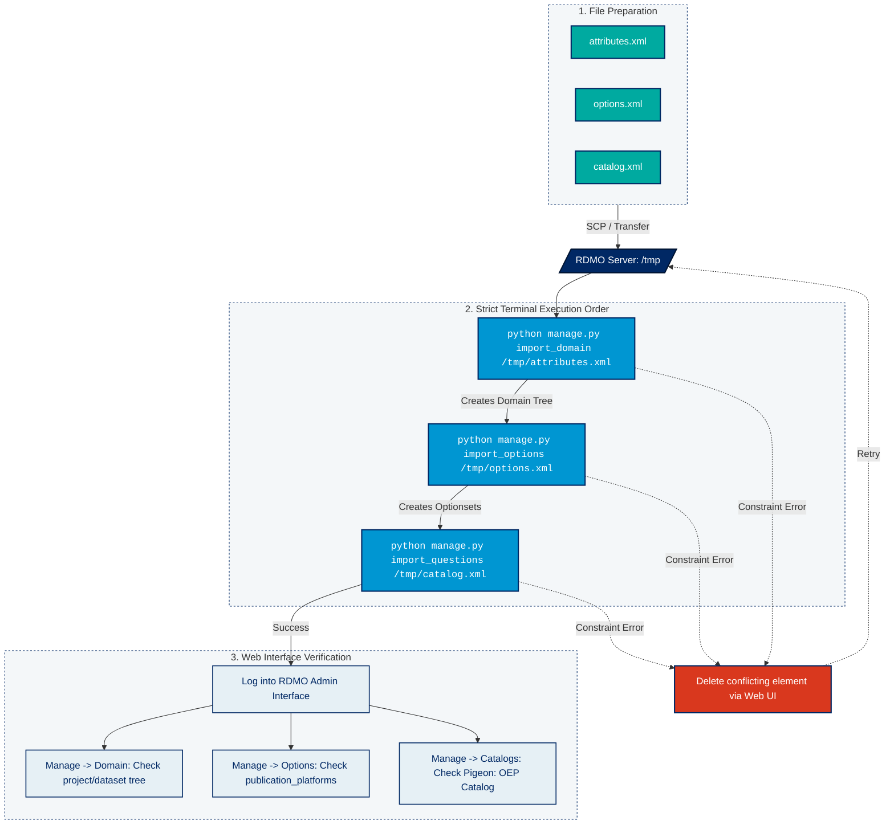

## on docker
```bash
python manage.py import ../rdmo-addons/pigeon_attributes.xml
```
## on host
```bash
psql -h localhost -p 5432 -U rdmo -d rdmo
```
```sql
SELECT id, uri, path, comment 
FROM domain_attribute 
WHERE uri LIKE 'https://kit.edu/terms/domain/project/dataset/%'
ORDER BY uri;
```
| id | uri | path | comment |
| --- | --- | --- | --- |
| 330 | [https://kit.edu/terms/domain/project/dataset/column](https://kit.edu/terms/domain/project/dataset/column) | project/dataset/column |  |
| 334 | [https://kit.edu/terms/domain/project/dataset/column/description](https://kit.edu/terms/domain/project/dataset/column/description) | project/dataset/column/description |  |
| 333 | [https://kit.edu/terms/domain/project/dataset/column/is_about](https://kit.edu/terms/domain/project/dataset/column/is_about) | project/dataset/column/is_about |  |
| 336 | [https://kit.edu/terms/domain/project/dataset/column/name](https://kit.edu/terms/domain/project/dataset/column/name) | project/dataset/column/name |  |
| 335 | [https://kit.edu/terms/domain/project/dataset/column/unit](https://kit.edu/terms/domain/project/dataset/column/unit) | project/dataset/column/unit |  |
| 331 | [https://kit.edu/terms/domain/project/dataset/instrument](https://kit.edu/terms/domain/project/dataset/instrument) | project/dataset/instrument |  |
| 337 | [https://kit.edu/terms/domain/project/dataset/instrument/pidinst](https://kit.edu/terms/domain/project/dataset/instrument/pidinst) | project/dataset/instrument/pidinst |  |
| 332 | [https://kit.edu/terms/domain/project/dataset/publication](https://kit.edu/terms/domain/project/dataset/publication) | project/dataset/publication |  |
| 338 | [https://kit.edu/terms/domain/project/dataset/publication/platform](https://kit.edu/terms/domain/project/dataset/publication/platform) | project/dataset/publication/platform |  |
 (9 rows)

## on docker
```bash
python manage.py import ../rdmo-addons/pigeon_options.xml
```
## on host
```bash
psql -h localhost -p 5432 -U rdmo -d rdmo
```
```sql
SELECT 
    os.uri AS optionset_uri, 
    o.uri AS option_uri
FROM options_optionset os
JOIN options_optionsetoption oso ON os.id = oso.optionset_id
JOIN options_option o ON oso.option_id = o.id
WHERE os.uri = 'https://kit.edu/terms/options/publication_platforms';
```
| optionset_uri                                       | option_uri                                         |
|-----------------------------------------------------|----------------------------------------------------|
| https://kit.edu/terms/options/publication_platforms | https://kit.edu/terms/options/platform_oep         |
| https://kit.edu/terms/options/publication_platforms | https://kit.edu/terms/options/platform_zenodo_test |
| https://kit.edu/terms/options/publication_platforms | https://kit.edu/terms/options/platform_internal    |

(3 rows)

## on host (script is on docker)
```bash
docker exec -w /vol/rdmo-app -i rdc-rdmo python manage.py shell -c "exec(open('/tmp/delete_kit.py').read())"
```

## on host (script is also on host)
```bash
docker exec -w /vol/rdmo-app -i rdc-rdmo python manage.py shell << delete_kit.py
```